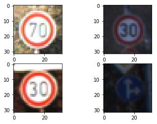

#**Traffic Sign Recognition** 

**Overview**
---
In this project assignment for Udacity's Self Driving Car Nano Degree, a traffic sign classification algorithm is implemented using the convolutional neural network technique. The task requires classifying of 43 different types of traffic sign. My implementation has achieved 97.5% accuracy on the test data set. Please refer to my [project code](https://github.com/jake5452/CarND-Traffic-Sign-Classifier-Project/blob/master/Traffic_Sign_Classifier.ipynb)

**Discussion**

###1. Data Set Summary & Exploration

Following is the summary of statistics on the data set:
* The size of training set is 34799
* The size of the validation set is 4410
* The size of test set is 12630
* The shape of a traffic sign image is 32 by 32
* The number of unique classes/labels in the data set is 43

To see the distribution of the dataset, a histogram can be plotted:

We can clearly see that from above, the distribution is not uniform and needs to be factored in for training of the neural network.

Here is visualizations of some samples from the dataset:

###Data Preprocessing
As a first step, I decided to normalize the each image by subtracting the mean and dividing by the standard deviation. The output image contained pixels that vary from 0 to 1 and normalized. This step is done to remove any high frequency noise in the data. Also this maps raw data to the normal distribution with 0 mean and 1 standard deviation.

###2. Model Architecture
First I tried implementing LeNet to do solve the classification problem. The validation accuracy hovered around 93-95% when trained with the data augmentation. I decided to try a deeper model with more convolutional filters so that the neural network can utilize more high-level features to understand and evaluate the images. 

My final model consisted of the following layers:

| Layer         		|     Description	        					| 
|:---------------------:|:---------------------------------------------:| 
| Input         		| 32x32x3 RGB image   							| 
| Convolution 5x5     	| 1x1 stride, valid padding, outputs 28x28x32 	|
| RELU					|												|
| Convolution 5x5     	| 1x1 stride, same padding, outputs 28x28x32 	|
| RELU					|												|
| Convolution 5x5     	| 1x1 stride, same padding, outputs 28x28x32 	|
| RELU					|												|
| Convolution 5x5     	| 1x1 stride, same padding, outputs 28x28x32 	|
| Max pooling	      	| 2x2 stride,  outputs 14x14x32 				|
| Convolution 5x5     	| 1x1 stride, valid padding, outputs 10x10x32 	|
| RELU					|												|
| Convolution 5x5     	| 1x1 stride, same padding, outputs 10x10x32 	|
| RELU					|												|
| Convolution 5x5     	| 1x1 stride, same padding, outputs 10x10x32 	|
| RELU					|												|
| Max pooling	      	| 2x2 stride,  outputs 5x5x32 |
| Dropout	 |           	|
| Flaaten					| outputs 800x1 |
| Fully connected		| outputs 120x1	|
| RELU					|												|
| Fully connected		| outputs 84x1	|
| RELU					|												|
| Fully connected		| outputs 43x1 |
| Softmax				| outputs 43x1	|

####3. Training
To train the model, I used Adam optimizer with the learning rate of 0.0009. Adam optimizer provides the advantages of both adaptive gradient algorithm and root mean square propagation, which adjusts the learning rate of each parameter according to what is happening in each gradient descent step. This allows more robust training of the neural network model.

Learning rate was iteratively tuned to make sure the model trains fast enough with high accuracy.

I also added a dropout layer so that I can train the model with a dropout value of 50% to allow faster training and less over-fitting of the model.

Moreover, many different batch size and number of epochs have been tried out to make the training more effective. Larger batch size was favourable for training because it helps to gradient descent to converge faster and the parallel structure of GPU can be leveraged. However, too large batch size used too much GPU memory causing memory overflow. The batch size of 100 was determined to be best parameter value.

Even though the number of epochs has been set to 60, it turned out anything beyond 30 epochs no significant improvements could be observed.

####4. Improving accuracy
As mentioned above, I used deeper architecture after trying out LeNet as baseline. Using iterative approach to determine number of layers and filter sizes per each convolutional layer, I settled with my current TrafficSignNet with 10 layers. Each convolutional layers has 32 filters. My reasoning behind using deeper model is to make sure the neural net has enough layers to create more complex abstraction on different features of the traffic signs.

Without data augmentation my model achieved around 95% validation accuracy while achieving 99% training accuracy. Clearly, the model was underfitting. I decided that data augmentation will help me to solve the problem by making sure the network can make more generalized inferences. The data augmentation process was designed to ensure that there is even distribution in the data. It was performed by adding random geometric transformation to the images like shifting to left or right, or stretching the image. Here are some examples of images from the augmented dataset:

After augmenting the dataset, I was able to improve the accuracy of the model to around 98% validation accuracy. I tried adding a drop out layer to see if the training can be done faster and hopefully improve the validation accuracy as well. The drop out layer helps to make sure different parts of the neural networking gets trained to the dataset so that the overall architecture can converge to more accurate output. Random elimination of parts of the architecture also helps to combat over-fitting. The drop out layer allowed me to use faster learning rate (0.0009 vs 0.0001) but did not improve my validation accuracy unfortunately. Perhaps this was because to get even better I needed even deeper architecture or better preprocessing scheme for the dataset such as histogram equalization.

My final model results were:
* training set accuracy of 99.8%
* validation set accuracy of 99.2%
* test set accuracy of 97.6%

Since the model has never seen validation and test data set during the training and it performed well on those data set, it can be concluded that the training of the model has been successful. Larger test data set may provide more insight into the model's accuracy.
 

###5. Testing the Model on New Images
Here are six German traffic signs that I found on the web:

The first image might be difficult to classify because ...

Here are the results of the prediction:

| Image			        |     Prediction	        					| 
|:---------------------:|:---------------------------------------------:| 
| Speed limit (60km/h)     		| Speed limit (60km/h)   									| 
| Speed limit (30km/h)     			| Speed limit (30km/h) 										|
| Priority road					| Priority road											|
| Keep right      		| Keep right					 				|
| Right-of-way at the next intersection			| Right-of-way at the next intersection      							|
| Turn left ahead		| Turn left ahead    							|
| Road work | Road work      							|

The model was able to correctly guess 5 of the 5 traffic signs, which gives an accuracy of 100%. This compares favorably to the accuracy on the test set of 97.6%.

In terms of top k softmax probabilities, my model was able to predict each test image with very close to 100% confidence as shwon in below:

